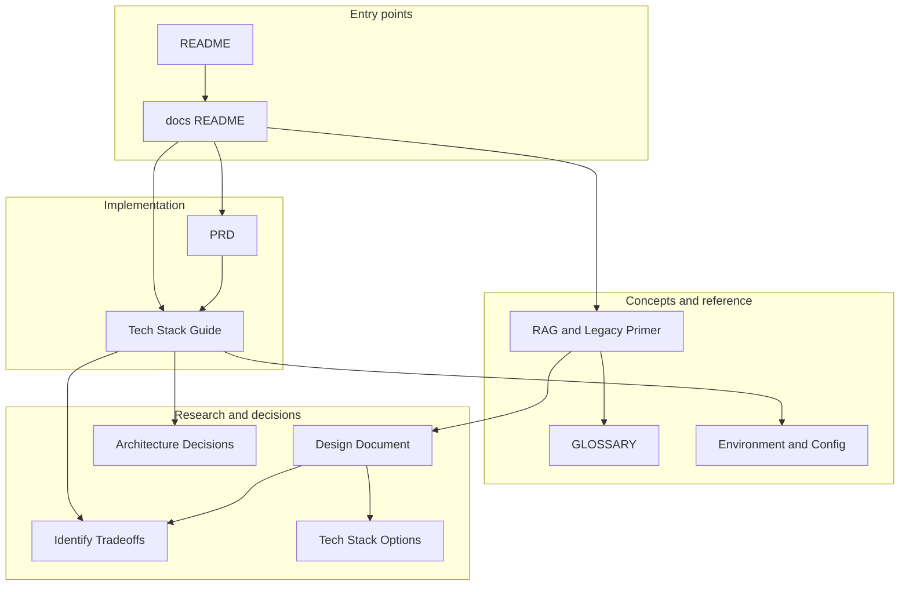

# LegacyLens Documentation Index

This page maps all documentation: what each doc is for, when to read it, and how research and implementation docs relate. Start from the main [README](../README.md) for setup and usage.

---

## For new developers

Recommended order:

1. **[README](../README.md)** — Overview, prerequisites, setup, and basic commands.
2. **[RAG and Legacy Code Primer](technology/RAG-AND-LEGACY-PRIMER.md)** — What RAG is, end-to-end flow, why legacy code is different, and how the stack fits.
3. **[Tech Stack In-Depth Guide](technology/TECH-STACK-GUIDE.md)** — How to set up and use each technology (Python/LlamaIndex, Pinecone, Voyage, Claude, Redis, Vercel, CLI, etc.).
4. **[Environment and Configuration](technology/ENVIRONMENT-AND-CONFIG.md)** — All environment variables, required vs optional, where to get keys, and secrets handling.
5. **[PRD](PRD.md)** — Product requirements, epics, user stories, and module structure.
6. **[Design Document](research/DESIGN-DOCUMENT.md)** — Locked-in architecture, tech stack rationale, and agile breakdown.

Use the **[Glossary](GLOSSARY.md)** whenever you need a definition for a term (RAG, embedding, hybrid search, reranker, etc.).

---

## For implementation

- **[PRD](PRD.md)** — Epics, user stories, acceptance criteria, and development workflow (branching, commits).
- **[Tech Stack In-Depth Guide](technology/TECH-STACK-GUIDE.md)** — Per-component setup, configuration, and troubleshooting.
- **[Environment and Configuration](technology/ENVIRONMENT-AND-CONFIG.md)** — Env vars and where they are used.
- **[Glossary](GLOSSARY.md)** — Shared terminology.

---

## For understanding decisions

- **[Design Document](research/DESIGN-DOCUMENT.md)** — Architecture overview, locked-in stack, and epic/user-story breakdown.
- **[Record Architecture Decisions](research/RECORD-ARCHITECTURE-DECISIONS.md)** — ADRs for vector DB, embeddings, chunking, retrieval, LLM, CLI, deployment, and cost.
- **[Identify Tradeoffs](research/IDENTIFY-TRADEOFFS.md)** — Tradeoff tables (vector DB, embeddings, framework, LLM, stacks) and rationale for chosen options.
- **[Tech Stack Options](research/TECH-STACK-OPTIONS.md)** — Alternative stacks (prototyping, production, advanced) and when to use them.
- **[Pre-Search Report (INITIAL)](research/INITIAL.md)** — Pre-search synthesis and stack comparison.
- **[Pre-Search Checklist](research/PRE-SEARCH-CHECKLIST.md)** — Phased checklist (constraints, architecture discovery, refinement).

---

## Quick reference

- **[README](../README.md)** — Setup, commands, example queries.
- **[PRD Appendix D](PRD.md#appendix-d-tech-stack-quick-reference)** — Tech stack table with versions and doc links.
- **[Glossary](GLOSSARY.md)** — Term definitions.

---

## Document relationship

Research (design, ADRs, tradeoffs, stack options) informs the PRD and the tech guide; the tech guide and environment doc support implementation; the primer and glossary support onboarding and consistent language.
