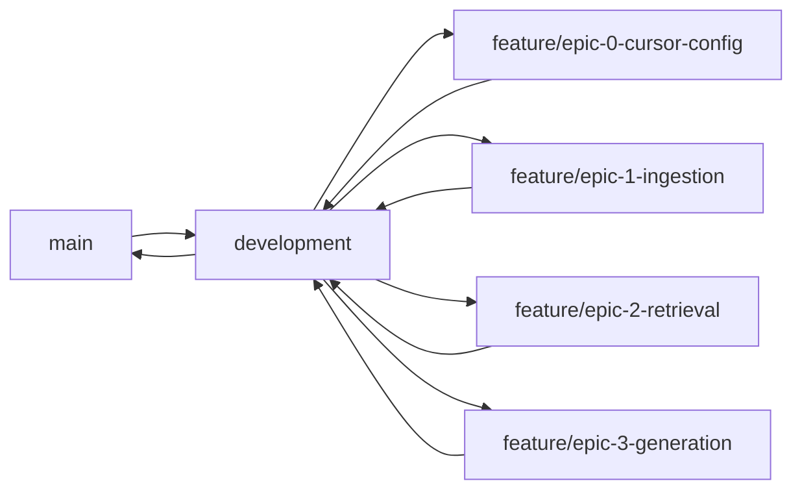
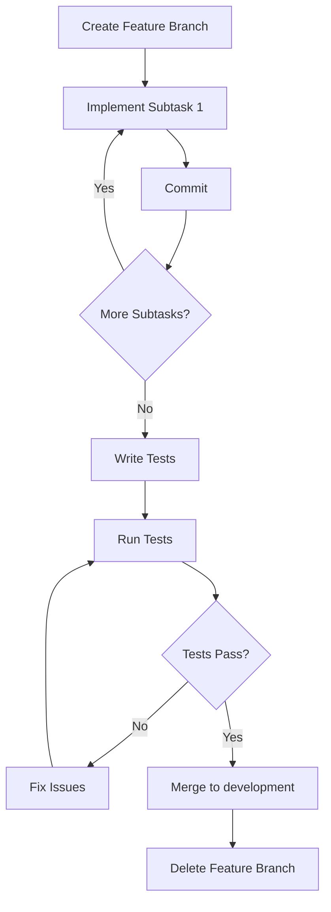
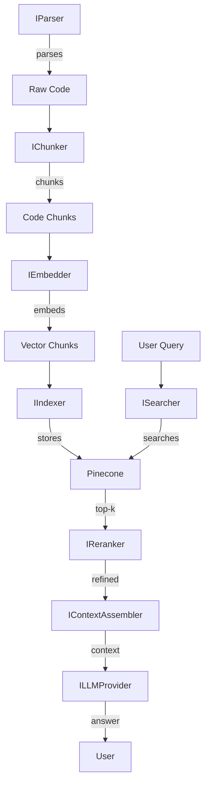
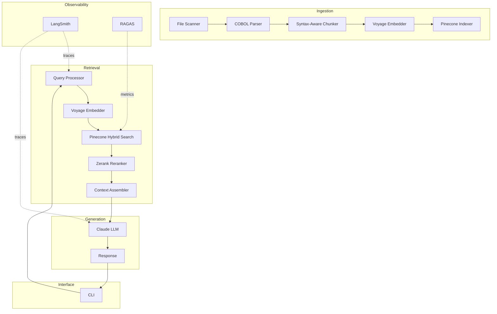
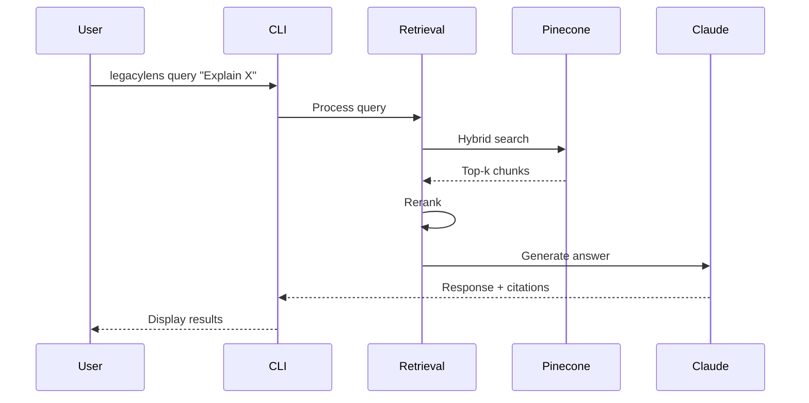

# LegacyLens Product Requirements Document (PRD)

**Version**: 1.0  
**Author**: Michael (@habermoose)  
**Date**: February 06, 2026  
**Project**: LegacyLens - RAG System for Legacy Enterprise Codebases  
**Repository**: https://github.com/MichaelHabermas/LegacyLens-1

---

## Table of Contents

1. [Executive Summary](#executive-summary)
2. [Development Workflow](#development-workflow)
3. [Architecture Principles](#architecture-principles)
4. [Epic 0: Project Foundation & Configuration](#epic-0-project-foundation--configuration)
5. [Epic 1: Codebase Ingestion Pipeline](#epic-1-codebase-ingestion-pipeline)
6. [Epic 2: Retrieval Pipeline](#epic-2-retrieval-pipeline)
7. [Epic 3: Answer Generation](#epic-3-answer-generation)
8. [Epic 4: Query Interface (CLI)](#epic-4-query-interface-cli)
9. [Epic 5: Observability & Monitoring](#epic-5-observability--monitoring)
10. [Epic 6: MVP Hardening & Validation](#epic-6-mvp-hardening--validation)
11. [Post-MVP Epics](#post-mvp-epics)
12. [Appendices](#appendices)

---

## Executive Summary

LegacyLens is a RAG-powered system that makes legacy enterprise codebases (COBOL, Fortran) queryable via natural language. This PRD details the implementation roadmap from MVP (24 hours) through final deployment (7 days), following SOLID principles and modular architecture.

**Key Objectives**:

- ☐ MVP delivery in 24 hours (basic RAG pipeline)
- ☐ Early submission in 4 days (full features)
- ☐ Final polish in 7 days (deployment + documentation)
- ☐ >70% retrieval precision, <3s latency, <$10 dev cost

**Target Codebase**: GnuCOBOL (open-source COBOL compiler, 10K+ LOC)

**Tech Stack** (Stack 3 - Managed Cloud):

- **Language**: Python 3.11+
- **Framework**: LlamaIndex (Workflows 1.0 + LlamaAgents Builder + LlamaParse v2)
- **Vector DB**: Pinecone Serverless
- **Embeddings**: Voyage-code-3 (1536 dims)
- **LLM**: Claude 4.5 Sonnet
- **Reranker**: Zerank-2
- **Graph DB**: Neo4j (for dependencies)
- **Caching**: Redis
- **Deployment**: Vercel Serverless
- **Interface**: CLI (Python with Rich/Pygments)
- **Observability**: Arize Phoenix + LangSmith
- **CI/CD**: GitHub Actions

---

## Development Workflow

### Git Branching Strategy



**Rules**:

1. **Never commit directly to `main`**
2. **All development happens in `development` branch**
3. **Feature branches created from `development`**
4. **Feature workflow**:
   ```
   Create Feature Branch → Implement (commits) → Write Tests → Run Tests →
   Fix Issues → Rerun Tests → Merge to development
   ```
5. **Branch naming**: `feature/epic-X-short-description`
6. **Commit naming**: `feat(scope): description` or `fix(scope): description`

### Commit Standards

Follow [Conventional Commits](https://www.conventionalcommits.org/):

- `feat(ingestion): add AST parser for COBOL`
- `fix(retrieval): correct metadata filtering logic`
- `test(ingestion): add unit tests for chunker`
- `docs(readme): update setup instructions`
- `refactor(retrieval): extract reranker interface`

### Development Cycle per Feature



---

## Architecture Principles

### SOLID Principles Implementation

1. **Single Responsibility Principle (SRP)**
   - Each module handles ONE concern
   - Example: `ChunkerModule` only splits code; `EmbedderModule` only generates vectors

2. **Open-Closed Principle (OCP)**
   - Modules extensible via interfaces
   - Example: Add Fortran parser without modifying core `ParserInterface`

3. **Liskov Substitution Principle (LSP)**
   - Subclasses replaceable without breaking behavior
   - Example: `COBOLChunker` can replace `BaseChunker`

4. **Interface Segregation Principle (ISP)**
   - Small, focused interfaces
   - Example: `IEmbedder`, `ISearcher`, `IReranker` separate

5. **Dependency Inversion Principle (DIP)**
   - High-level modules depend on abstractions
   - Example: Inject vector DB via `IVectorStore` interface

### Module Structure

```
src/
├── core/
│   ├── interfaces/          # Abstract base classes
│   ├── exceptions/          # Custom exceptions
│   └── config/              # Configuration management
├── ingestion/
│   ├── parsers/             # Language-specific AST parsers
│   ├── chunkers/            # Syntax-aware chunking
│   ├── embedders/           # Embedding generation
│   └── indexers/            # Vector DB interaction
├── retrieval/
│   ├── searchers/           # Hybrid search
│   ├── rerankers/           # Second-pass reranking
│   └── assemblers/          # Context assembly
├── generation/
│   ├── llm_providers/       # LLM integrations
│   └── prompt_templates/    # Citation-focused prompts
├── interface/
│   └── cli/                 # CLI implementation
└── observability/
    ├── logging/             # Structured logging
    └── metrics/             # Performance tracking
```

---

## Epic 0: Project Foundation & Configuration

**Goal**: Set up development environment, .cursor/rules, tooling, and repository structure.

**Branch**: `feature/epic-0-foundation`

**Duration**: 2-3 hours

### Epic 0 Progress

- ☐ 0.1 Project Setup Complete
- ☐ 0.2 Cursor Rules Configured
- ☐ 0.3 Dependencies Installed
- ☐ 0.4 Core Interfaces Defined

---

### User Story 0.1: Project Scaffolding

**As a** developer  
**I want** a properly structured Python project with CI/CD  
**So that** I can develop efficiently with consistent tooling

#### Feature 0.1.1: Repository Structure Setup

**Feature Branch**: `feature/epic-0-repo-structure`

**Commits**:

##### Commit 1: `feat(init): initialize project structure`

**Subtasks**:

- [ ] Create directory structure (`src/`, `tests/`, `docs/`, `.github/`)
- [ ] Add `.gitignore` (Python, IDE, env files)
- [ ] Create `README.md` with setup instructions
- [ ] Initialize `pyproject.toml` with project metadata

##### Commit 2: `feat(init): add Python packaging config`

**Subtasks**:

- [ ] Configure `pyproject.toml` with dependencies:
  - `llama-index>=0.10.0`
  - `llama-index-llms-anthropic>=0.1.0`
  - `llama-index-embeddings-voyageai>=0.1.0`
  - `pinecone-client>=3.0.0`
  - `redis>=5.0.0`
  - `neo4j>=5.0.0`
  - `rich>=13.0.0`
  - `pygments>=2.0.0`
  - `pydantic>=2.0.0`
  - `pytest>=8.0.0`
  - `pytest-asyncio>=0.23.0`
  - `pytest-cov>=4.0.0`
- [ ] Add dev dependencies (`black`, `ruff`, `mypy`, `pre-commit`)
- [ ] Create `requirements.txt` and `requirements-dev.txt`

##### Commit 3: `feat(ci): add GitHub Actions workflows`

**Subtasks**:

- [ ] Create `.github/workflows/test.yml` (run tests on PR)
- [ ] Create `.github/workflows/lint.yml` (black, ruff, mypy)
- [ ] Create `.github/workflows/deploy.yml` (Vercel deployment)
- [ ] Add branch protection rules in workflow config

##### Commit 4: `docs(readme): add comprehensive setup guide`

**Subtasks**:

- [ ] Document installation steps
- [ ] Add environment variable setup instructions
- [ ] Include development workflow guide
- [ ] Add troubleshooting section

**Tests**:

- [ ] Verify `pyproject.toml` parses correctly
- [ ] Run `pip install -e .` successfully
- [ ] GitHub Actions workflows validate

---

### User Story 0.2: Cursor Rules Configuration

**As a** developer  
**I want** Cursor AI configured with project-specific rules  
**So that** code suggestions follow SOLID principles and tech stack

#### Feature 0.2.1: .cursor/rules File

**Feature Branch**: `feature/epic-0-cursor-rules`

**Commits**:

##### Commit 1: `feat(cursor): create .cursor/rules with tech stack`

**Subtasks**:

- [ ] Create `.cursor/rules` file
- [ ] Document Python 3.11+ as language
- [ ] Specify LlamaIndex framework conventions
- [ ] List all dependencies from Stack 3

##### Commit 2: `feat(cursor): add SOLID principle rules`

**Subtasks**:

- [ ] Add SRP guidelines (one concern per module)
- [ ] Add OCP guidelines (interfaces for extension)
- [ ] Add LSP guidelines (subclass substitutability)
- [ ] Add ISP guidelines (small, focused interfaces)
- [ ] Add DIP guidelines (depend on abstractions)

##### Commit 3: `feat(cursor): add git workflow rules`

**Subtasks**:

- [ ] Specify branch naming conventions
- [ ] Document commit message format (Conventional Commits)
- [ ] Add PR template requirements
- [ ] Include merge strategy (squash for features)

##### Commit 4: `feat(cursor): add Context7 MCP integration`

**Subtasks**:

- [ ] Configure Context7 MCP for latest stable docs
- [ ] Add rules to always fetch:
  - LlamaIndex documentation
  - Pinecone API docs
  - Anthropic Claude docs
  - Voyage AI docs
  - Pydantic v2 docs
- [ ] Set up auto-refresh for documentation context

##### Commit 5: `feat(cursor): add code quality rules`

**Subtasks**:

- [ ] Specify type hints required (`mypy --strict`)
- [ ] Add docstring format (Google style)
- [ ] Require unit tests for all new functions
- [ ] Set line length limit (88 chars, Black default)
- [ ] Add import organization rules (isort)

**Example `.cursor/rules` structure**:

```markdown
# LegacyLens Cursor Rules

## Tech Stack

- Python 3.11+
- LlamaIndex (Workflows 1.0, LlamaAgents Builder, LlamaParse v2)
- Pinecone Serverless
- Voyage-code-3 embeddings
- Claude 4.5 Sonnet
- [... full stack list ...]

## SOLID Principles

[... detailed rules ...]

## Git Workflow

[... branch/commit conventions ...]

## Context7 MCP

Always use latest docs for:

- LlamaIndex: https://docs.llamaindex.ai/
- Pinecone: https://docs.pinecone.io/
- Anthropic: https://docs.anthropic.com/
- Voyage AI: https://docs.voyageai.com/

## Code Quality

- Type hints mandatory
- Docstrings required (Google style)
- Tests required for all features
- Black formatting (88 chars)
```

**Tests**:

- [ ] Verify `.cursor/rules` file exists
- [ ] Validate rule syntax and completeness

---

### User Story 0.3: Environment Configuration

**As a** developer  
**I want** environment variables and secrets managed securely  
**So that** API keys are never committed to version control

#### Feature 0.3.1: Environment Management

**Feature Branch**: `feature/epic-0-env-config`

**Commits**:

##### Commit 1: `feat(config): add environment variable template`

**Subtasks**:

- [ ] Create `.env.example` with all required vars:
  - `PINECONE_API_KEY`
  - `VOYAGE_API_KEY`
  - `ANTHROPIC_API_KEY`
  - `NEO4J_URI`, `NEO4J_USER`, `NEO4J_PASSWORD`
  - `REDIS_URL`
  - `LANGSMITH_API_KEY` (optional)
  - `ENVIRONMENT` (dev/staging/prod)
- [ ] Add comments explaining each variable
- [ ] Include `.env` in `.gitignore`

##### Commit 2: `feat(config): create config module`

**Subtasks**:

- [ ] Create `src/core/config/settings.py`
- [ ] Use `pydantic-settings` for validation
- [ ] Define `Settings` class with typed fields
- [ ] Add environment-specific config loading (dev/prod)
- [ ] Implement singleton pattern for config access

##### Commit 3: `test(config): add config validation tests`

**Subtasks**:

- [ ] Test config loads from environment
- [ ] Test missing required variables raise errors
- [ ] Test default values applied correctly
- [ ] Test environment-specific overrides

**Tests**:

- [ ] `test_config_loads_from_env()`
- [ ] `test_config_validates_required_keys()`
- [ ] `test_config_singleton_pattern()`

---

### User Story 0.4: Core Interfaces Definition

**As a** developer  
**I want** abstract interfaces defined upfront  
**So that** modules depend on abstractions (DIP)

#### Feature 0.4.1: Define Core Interfaces

**Feature Branch**: `feature/epic-0-interfaces`

**Commits**:

##### Commit 1: `feat(core): define ingestion interfaces`

**Subtasks**:

- [ ] Create `src/core/interfaces/parser.py`:
  - `IParser` (ABC with `parse_file()` method)
- [ ] Create `src/core/interfaces/chunker.py`:
  - `IChunker` (ABC with `chunk()` method)
- [ ] Create `src/core/interfaces/embedder.py`:
  - `IEmbedder` (ABC with `embed_batch()` method)
- [ ] Create `src/core/interfaces/indexer.py`:
  - `IIndexer` (ABC with `upsert()`, `delete()` methods)

##### Commit 2: `feat(core): define retrieval interfaces`

**Subtasks**:

- [ ] Create `src/core/interfaces/searcher.py`:
  - `ISearcher` (ABC with `search()` method)
- [ ] Create `src/core/interfaces/reranker.py`:
  - `IReranker` (ABC with `rerank()` method)
- [ ] Create `src/core/interfaces/assembler.py`:
  - `IContextAssembler` (ABC with `assemble()` method)

##### Commit 3: `feat(core): define generation interfaces`

**Subtasks**:

- [ ] Create `src/core/interfaces/llm_provider.py`:
  - `ILLMProvider` (ABC with `generate()` method)

##### Commit 4: `feat(core): define data models`

**Subtasks**:

- [ ] Create `src/core/models/chunk.py`:
  - `Chunk` (Pydantic model: content, metadata, embedding)
- [ ] Create `src/core/models/query.py`:
  - `Query` (Pydantic model: text, filters, top_k)
- [ ] Create `src/core/models/result.py`:
  - `SearchResult` (Pydantic model: chunks, scores, citations)

##### Commit 5: `docs(interfaces): add interface documentation`

**Subtasks**:

- [ ] Document each interface's purpose
- [ ] Add usage examples in docstrings
- [ ] Create architecture diagram (Mermaid)

**Architecture Diagram**:



**Tests**:

- [ ] Verify all interfaces are abstract (cannot instantiate)
- [ ] Test data models validate correctly

---

## Epic 1: Codebase Ingestion Pipeline

**Goal**: Ingest GnuCOBOL codebase, chunk with AST-based splitting, generate embeddings, store in Pinecone.

**Branch**: `feature/epic-1-ingestion`

**Duration**: 6-8 hours (critical for MVP)

### Epic 1 Progress

- ☐ 1.1 File Discovery Complete
- ☐ 1.2 COBOL Parser Implemented
- ☐ 1.3 Syntax-Aware Chunker Working
- ☐ 1.4 Embeddings Generated
- ☐ 1.5 Pinecone Integration Complete
- ☐ 1.6 Caching Implemented

---

### User Story 1.1: File Discovery & Preprocessing

**As a** developer  
**I want** to recursively scan the codebase and filter by file extension  
**So that** all COBOL files are discovered for ingestion

#### Feature 1.1.1: Codebase Scanner

**Feature Branch**: `feature/epic-1-file-discovery`

**Commits**:

##### Commit 1: `feat(ingestion): create file discovery module`

**Subtasks**:

- [ ] Create `src/ingestion/discovery/scanner.py`
- [ ] Implement `CodebaseScanner` class:
  - `scan_directory(path, extensions)` method
  - Recursive directory traversal
  - Filter by extensions (`.cob`, `.cbl`, `.f`, `.f90`)
  - Return list of file paths
- [ ] Add configuration for ignore patterns (`.git/`, `node_modules/`)

##### Commit 2: `feat(ingestion): add file preprocessing`

**Subtasks**:

- [ ] Create `src/ingestion/preprocessing/normalizer.py`
- [ ] Implement `FileNormalizer` class:
  - Handle encoding issues (UTF-8, Latin-1 fallback)
  - Normalize whitespace (consistent line endings)
  - Extract inline comments vs code
  - Preserve line number mappings
- [ ] Add error handling for corrupted files

##### Commit 3: `test(ingestion): add scanner tests`

**Subtasks**:

- [ ] Create `tests/ingestion/test_scanner.py`
- [ ] Test recursive scanning works
- [ ] Test file extension filtering
- [ ] Test ignore patterns respected
- [ ] Mock filesystem for tests

##### Commit 4: `test(ingestion): add normalizer tests`

**Subtasks**:

- [ ] Create `tests/ingestion/test_normalizer.py`
- [ ] Test encoding detection and conversion
- [ ] Test whitespace normalization
- [ ] Test comment extraction

**Tests**:

- [ ] `test_scanner_finds_all_cobol_files()`
- [ ] `test_scanner_respects_ignore_patterns()`
- [ ] `test_normalizer_handles_encodings()`
- [ ] `test_normalizer_preserves_line_numbers()`

---

### User Story 1.2: Syntax-Aware Parsing

**As a** developer  
**I want** AST-based parsing for COBOL  
**So that** logical boundaries (paragraphs, sections) are identified

#### Feature 1.2.1: COBOL AST Parser

**Feature Branch**: `feature/epic-1-cobol-parser`

**Commits**:

##### Commit 1: `feat(ingestion): implement IParser for COBOL`

**Subtasks**:

- [ ] Create `src/ingestion/parsers/cobol_parser.py`
- [ ] Implement `COBOLParser(IParser)`:
  - Use LlamaParse v2 for AST extraction
  - Identify DIVISION, SECTION, PARAGRAPH boundaries
  - Extract PROCEDURE DIVISION structure
  - Map line numbers to logical units
- [ ] Handle parser errors gracefully (fallback to line-based)

##### Commit 2: `feat(ingestion): add metadata extraction`

**Subtasks**:

- [ ] Extract function/paragraph names
- [ ] Identify CALL statements (dependencies)
- [ ] Extract DATA DIVISION variables
- [ ] Store scope chains (DIVISION > SECTION > PARAGRAPH)

##### Commit 3: `test(ingestion): add parser tests`

**Subtasks**:

- [ ] Create `tests/ingestion/test_cobol_parser.py`
- [ ] Test PARAGRAPH detection
- [ ] Test metadata extraction (function names, calls)
- [ ] Test error handling for malformed code
- [ ] Use sample COBOL files from GnuCOBOL

**Tests**:

- [ ] `test_parser_identifies_paragraphs()`
- [ ] `test_parser_extracts_dependencies()`
- [ ] `test_parser_handles_malformed_code()`

---

### User Story 1.3: Hierarchical Chunking

**As a** developer  
**I want** syntax-aware chunking with hierarchical structure  
**So that** logical code units are preserved with context

#### Feature 1.3.1: COBOL Chunker

**Feature Branch**: `feature/epic-1-chunking`

**Commits**:

##### Commit 1: `feat(ingestion): implement IChunker for COBOL`

**Subtasks**:

- [ ] Create `src/ingestion/chunkers/cobol_chunker.py`
- [ ] Implement `COBOLChunker(IChunker)`:
  - Chunk by PARAGRAPH (primary)
  - Fallback: fixed-size with 10-25% overlap
  - Max chunk size: 512-8192 tokens (configurable)
  - Preserve hierarchical metadata (file > section > paragraph)

##### Commit 2: `feat(ingestion): add overlap strategy`

**Subtasks**:

- [ ] Implement token counting (via `tiktoken` or LlamaIndex utils)
- [ ] Add overlap logic (10-25% of chunk size)
- [ ] Ensure no duplicate content across chunks
- [ ] Handle edge cases (chunks smaller than overlap)

##### Commit 3: `feat(ingestion): create Chunk data models`

**Subtasks**:

- [ ] Use `src/core/models/chunk.py`
- [ ] Add fields:
  - `content: str` (chunk text)
  - `metadata: dict` (file_path, line_start, line_end, scope_chain, language)
  - `embedding: Optional[List[float]]` (populated later)
  - `chunk_id: str` (UUID)

##### Commit 4: `test(ingestion): add chunker tests`

**Subtasks**:

- [ ] Create `tests/ingestion/test_chunker.py`
- [ ] Test paragraph-based chunking
- [ ] Test overlap calculation
- [ ] Test metadata preservation
- [ ] Test token limits respected

**Tests**:

- [ ] `test_chunker_respects_paragraph_boundaries()`
- [ ] `test_chunker_applies_overlap()`
- [ ] `test_chunker_preserves_metadata()`
- [ ] `test_chunker_handles_large_functions()`

---

### User Story 1.4: Embedding Generation

**As a** developer  
**I want** to generate Voyage-code-3 embeddings for chunks  
**So that** semantic search is enabled

#### Feature 1.4.1: Voyage Embedder

**Feature Branch**: `feature/epic-1-embeddings`

**Commits**:

##### Commit 1: `feat(ingestion): implement IEmbedder with Voyage`

**Subtasks**:

- [ ] Create `src/ingestion/embedders/voyage_embedder.py`
- [ ] Implement `VoyageEmbedder(IEmbedder)`:
  - Use `voyageai` SDK
  - Batch processing (up to 128 chunks per call)
  - Handle rate limiting (exponential backoff)
  - Return embeddings as `List[List[float]]`

##### Commit 2: `feat(ingestion): add embedding caching`

**Subtasks**:

- [ ] Create `src/ingestion/embedders/cache.py`
- [ ] Implement Redis-based caching:
  - Key: content hash (SHA256 of chunk content)
  - Value: embedding vector
  - TTL: 30 days (configurable)
- [ ] Skip API call if cached embedding exists

##### Commit 3: `feat(ingestion): add retry logic`

**Subtasks**:

- [ ] Implement exponential backoff for API failures
- [ ] Max retries: 3
- [ ] Log failed embeddings for manual review
- [ ] Fallback: skip chunk and continue (log warning)

##### Commit 4: `test(ingestion): add embedder tests`

**Subtasks**:

- [ ] Create `tests/ingestion/test_embedder.py`
- [ ] Mock Voyage API responses
- [ ] Test batch processing
- [ ] Test cache hits/misses
- [ ] Test retry logic

**Tests**:

- [ ] `test_embedder_calls_voyage_api()`
- [ ] `test_embedder_uses_cache()`
- [ ] `test_embedder_handles_rate_limits()`
- [ ] `test_embedder_batch_processing()`

---

### User Story 1.5: Vector Database Integration

**As a** developer  
**I want** to store embeddings in Pinecone with metadata  
**So that** hybrid search is enabled

#### Feature 1.5.1: Pinecone Indexer

**Feature Branch**: `feature/epic-1-pinecone`

**Commits**:

##### Commit 1: `feat(ingestion): implement IIndexer for Pinecone`

**Subtasks**:

- [ ] Create `src/ingestion/indexers/pinecone_indexer.py`
- [ ] Implement `PineconeIndexer(IIndexer)`:
  - Initialize Pinecone client (serverless)
  - Create index if not exists (1536 dims, cosine metric)
  - Upsert chunks with metadata
  - Support batch upserts (100 vectors per batch)

##### Commit 2: `feat(ingestion): add metadata schema`

**Subtasks**:

- [ ] Define metadata fields for Pinecone:
  - `file_path: str`
  - `line_start: int`, `line_end: int`
  - `scope_chain: str` (e.g., "DIVISION/SECTION/PARAGRAPH")
  - `language: str` ("cobol")
  - `chunk_type: str` ("paragraph", "function", "section")
- [ ] Enable metadata filtering in Pinecone

##### Commit 3: `feat(ingestion): add incremental updates`

**Subtasks**:

- [ ] Implement `delete_by_file_path()` method
- [ ] Support partial re-indexing (delete old chunks, upsert new)
- [ ] Add version tracking (metadata field `indexed_at: timestamp`)

##### Commit 4: `test(ingestion): add indexer tests`

**Subtasks**:

- [ ] Create `tests/ingestion/test_indexer.py`
- [ ] Mock Pinecone API
- [ ] Test upsert operations
- [ ] Test metadata filtering
- [ ] Test batch operations

**Tests**:

- [ ] `test_indexer_creates_index()`
- [ ] `test_indexer_upserts_chunks()`
- [ ] `test_indexer_handles_metadata()`
- [ ] `test_indexer_batch_upserts()`

---

### User Story 1.6: Ingestion Orchestration

**As a** developer  
**I want** an end-to-end ingestion pipeline  
**So that** the entire codebase is indexed in <5 minutes

#### Feature 1.6.1: Ingestion Workflow

**Feature Branch**: `feature/epic-1-orchestration`

**Commits**:

##### Commit 1: `feat(ingestion): create ingestion orchestrator`

**Subtasks**:

- [ ] Create `src/ingestion/orchestrator.py`
- [ ] Implement `IngestionOrchestrator`:
  - Inject all dependencies (scanner, parser, chunker, embedder, indexer)
  - `ingest_codebase(path)` method:
    1. Scan files
    2. Parse each file
    3. Chunk parsed content
    4. Generate embeddings (with caching)
    5. Upsert to Pinecone
  - Progress tracking (log % complete)
  - Error handling (log failures, continue)

##### Commit 2: `feat(ingestion): add CLI command for ingestion`

**Subtasks**:

- [ ] Create `src/cli/ingest.py`
- [ ] Add command: `legacylens ingest <path>`
- [ ] Show progress bar (using `rich.progress`)
- [ ] Display summary stats (files processed, chunks created, errors)

##### Commit 3: `test(ingestion): add orchestrator tests`

**Subtasks**:

- [ ] Create `tests/ingestion/test_orchestrator.py`
- [ ] Mock all dependencies
- [ ] Test end-to-end flow
- [ ] Test error handling (continue on failure)

##### Commit 4: `perf(ingestion): optimize for throughput`

**Subtasks**:

- [ ] Add parallel processing (async/await)
- [ ] Batch embeddings (max 128 per API call)
- [ ] Optimize Pinecone upserts (max 100 per batch)
- [ ] Target: 10K LOC in <5 minutes

**Tests**:

- [ ] `test_orchestrator_ingests_codebase()`
- [ ] `test_orchestrator_handles_errors()`
- [ ] `test_orchestrator_performance()` (benchmark)

---

## Epic 2: Retrieval Pipeline

**Goal**: Implement hybrid search, reranking, and context assembly for accurate retrieval.

**Branch**: `feature/epic-2-retrieval`

**Duration**: 4-6 hours

### Epic 2 Progress

- ☐ 2.1 Query Processing Complete
- ☐ 2.2 Hybrid Search Implemented
- ☐ 2.3 Reranking Working
- ☐ 2.4 Context Assembly Complete
- ☐ 2.5 Multi-Query Expansion Implemented

---

### User Story 2.1: Query Processing

**As a** user  
**I want** my natural language queries parsed and embedded  
**So that** semantic search finds relevant code

#### Feature 2.1.1: Query Processor

**Feature Branch**: `feature/epic-2-query-processing`

**Commits**:

##### Commit 1: `feat(retrieval): create query processor`

**Subtasks**:

- [ ] Create `src/retrieval/processors/query_processor.py`
- [ ] Implement `QueryProcessor`:
  - Parse NL query
  - Extract entities (variable names, function names)
  - Detect query intent (explanation, dependency, pattern search)
  - Normalize query (lowercase, remove stop words for keyword search)

##### Commit 2: `feat(retrieval): add query embedding`

**Subtasks**:

- [ ] Reuse `VoyageEmbedder` for query embedding
- [ ] Cache query embeddings (Redis, TTL: 1 hour)
- [ ] Return `Query` model (text, embedding, filters)

##### Commit 3: `test(retrieval): add query processor tests`

**Subtasks**:

- [ ] Create `tests/retrieval/test_query_processor.py`
- [ ] Test entity extraction
- [ ] Test intent detection
- [ ] Test embedding generation

**Tests**:

- [ ] `test_processor_extracts_entities()`
- [ ] `test_processor_detects_intent()`
- [ ] `test_processor_embeds_query()`

---

### User Story 2.2: Hybrid Search

**As a** user  
**I want** hybrid search (vector + keyword)  
**So that** exact identifiers like "CUSTOMER-RECORD" are matched

#### Feature 2.2.1: Pinecone Hybrid Search

**Feature Branch**: `feature/epic-2-hybrid-search`

**Commits**:

##### Commit 1: `feat(retrieval): implement ISearcher for Pinecone`

**Subtasks**:

- [ ] Create `src/retrieval/searchers/pinecone_searcher.py`
- [ ] Implement `PineconeSearcher(ISearcher)`:
  - Hybrid search: vector similarity + BM25 keyword
  - Configurable `top_k` (default: 20-50)
  - Metadata filtering support
  - Return `List[SearchResult]`

##### Commit 2: `feat(retrieval): add metadata filtering`

**Subtasks**:

- [ ] Support filtering by:
  - `file_path` (exact match or prefix)
  - `language` (e.g., "cobol")
  - `chunk_type` (e.g., "paragraph")
- [ ] Combine filters with AND logic

##### Commit 3: `test(retrieval): add searcher tests`

**Subtasks**:

- [ ] Create `tests/retrieval/test_searcher.py`
- [ ] Mock Pinecone API
- [ ] Test hybrid search results
- [ ] Test metadata filtering

**Tests**:

- [ ] `test_searcher_hybrid_search()`
- [ ] `test_searcher_metadata_filtering()`
- [ ] `test_searcher_returns_top_k()`

---

### User Story 2.3: Reranking

**As a** user  
**I want** reranking of search results  
**So that** top-5 results are most relevant

#### Feature 2.3.1: Zerank-2 Reranker

**Feature Branch**: `feature/epic-2-reranking`

**Commits**:

##### Commit 1: `feat(retrieval): implement IReranker with Zerank-2`

**Subtasks**:

- [ ] Create `src/retrieval/rerankers/zerank_reranker.py`
- [ ] Implement `ZerankReranker(IReranker)`:
  - Load Zerank-2 model (HuggingFace or API)
  - Rerank top-k results (input: 20-50, output: 5-10)
  - Assign relevance scores
  - Return sorted `List[SearchResult]`

##### Commit 2: `feat(retrieval): add score normalization`

**Subtasks**:

- [ ] Normalize reranker scores to 0-1 range
- [ ] Combine with original search scores (weighted avg)
- [ ] Configurable weights (default: 70% reranker, 30% search)

##### Commit 3: `test(retrieval): add reranker tests`

**Subtasks**:

- [ ] Create `tests/retrieval/test_reranker.py`
- [ ] Mock Zerank API/model
- [ ] Test reranking improves precision
- [ ] Test score normalization

**Tests**:

- [ ] `test_reranker_reorders_results()`
- [ ] `test_reranker_normalizes_scores()`
- [ ] `test_reranker_handles_edge_cases()`

---

### User Story 2.4: Context Assembly

**As a** user  
**I want** retrieved chunks assembled with surrounding context  
**So that** LLM has sufficient information

#### Feature 2.4.1: Context Assembler

**Feature Branch**: `feature/epic-2-context-assembly`

**Commits**:

##### Commit 1: `feat(retrieval): implement IContextAssembler`

**Subtasks**:

- [ ] Create `src/retrieval/assemblers/context_assembler.py`
- [ ] Implement `ContextAssembler(IContextAssembler)`:
  - Take reranked results
  - Add surrounding context (±10 lines from chunk)
  - Deduplicate overlapping chunks
  - Format with file/line citations
  - Return assembled context string

##### Commit 2: `feat(retrieval): add citation formatting`

**Subtasks**:

- [ ] Format as: `[File: path/to/file.cob, Lines: 100-120]`
- [ ] Include syntax highlighting markers for LLM
- [ ] Preserve scope chain in citations

##### Commit 3: `test(retrieval): add assembler tests`

**Subtasks**:

- [ ] Create `tests/retrieval/test_assembler.py`
- [ ] Test context expansion works
- [ ] Test deduplication
- [ ] Test citation formatting

**Tests**:

- [ ] `test_assembler_adds_context()`
- [ ] `test_assembler_deduplicates()`
- [ ] `test_assembler_formats_citations()`

---

### User Story 2.5: Multi-Query Expansion (Agentic)

**As a** user  
**I want** ambiguous queries expanded into sub-queries  
**So that** complex questions are answered comprehensively

#### Feature 2.5.1: Agentic Query Expansion

**Feature Branch**: `feature/epic-2-query-expansion`

**Commits**:

##### Commit 1: `feat(retrieval): add query expansion with LlamaAgents`

**Subtasks**:

- [ ] Create `src/retrieval/expansion/query_expander.py`
- [ ] Implement `QueryExpander` (using LlamaAgents Builder):
  - Detect ambiguous queries (e.g., "error handling patterns")
  - Generate sub-queries (e.g., "error handling in module X", "exception handling in module Y")
  - Execute searches for each sub-query
  - Merge results
- [ ] Configurable max sub-queries (default: 3)

##### Commit 2: `test(retrieval): add expansion tests`

**Subtasks**:

- [ ] Create `tests/retrieval/test_expander.py`
- [ ] Mock LLM for sub-query generation
- [ ] Test sub-query merging

**Tests**:

- [ ] `test_expander_generates_subqueries()`
- [ ] `test_expander_merges_results()`

---

## Epic 3: Answer Generation

**Goal**: Synthesize LLM responses with strict citations using Claude 4.5 Sonnet.

**Branch**: `feature/epic-3-generation`

**Duration**: 3-4 hours

### Epic 3 Progress

- ☐ 3.1 LLM Provider Implemented
- ☐ 3.2 Prompt Templates Created
- ☐ 3.3 Citation Enforcement Working
- ☐ 3.4 Streaming Enabled

---

### User Story 3.1: LLM Integration

**As a** user  
**I want** accurate LLM-generated answers  
**So that** I understand code without reading it myself

#### Feature 3.1.1: Claude Provider

**Feature Branch**: `feature/epic-3-llm-provider`

**Commits**:

##### Commit 1: `feat(generation): implement ILLMProvider for Claude`

**Subtasks**:

- [ ] Create `src/generation/llm_providers/claude_provider.py`
- [ ] Implement `ClaudeProvider(ILLMProvider)`:
  - Use `anthropic` SDK
  - `generate(context, query)` method
  - Support streaming responses
  - Handle rate limiting

##### Commit 2: `feat(generation): add prompt caching`

**Subtasks**:

- [ ] Use Claude's prompt caching for context
- [ ] Cache retrieved code context (mark as `cache_control`)
- [ ] Reduce token costs by 90% on repeated queries

##### Commit 3: `test(generation): add provider tests`

**Subtasks**:

- [ ] Create `tests/generation/test_claude_provider.py`
- [ ] Mock Anthropic API
- [ ] Test generation works
- [ ] Test streaming

**Tests**:

- [ ] `test_provider_generates_response()`
- [ ] `test_provider_streams_response()`
- [ ] `test_provider_handles_errors()`

---

### User Story 3.2: Prompt Engineering

**As a** developer  
**I want** citation-focused prompt templates  
**So that** LLM provides accurate file/line references

#### Feature 3.2.1: Prompt Templates

**Feature Branch**: `feature/epic-3-prompts`

**Commits**:

##### Commit 1: `feat(generation): create prompt templates`

**Subtasks**:

- [ ] Create `src/generation/prompt_templates/`
- [ ] Add templates:
  - `code_explanation.txt`: Explain code with citations
  - `dependency_mapping.txt`: List dependencies with sources
  - `impact_analysis.txt`: Assess change impacts
  - `pattern_detection.txt`: Find code patterns
- [ ] Use Jinja2 for templating

##### Commit 2: `feat(generation): add citation enforcement`

**Subtasks**:

- [ ] Add to system prompt:
  - "Always cite file paths and line numbers"
  - "Use format: [File: path, Lines: X-Y]"
  - "If uncertain, say 'I don't know' instead of guessing"
- [ ] Add examples in prompt (few-shot learning)

##### Commit 3: `test(generation): add prompt tests`

**Subtasks**:

- [ ] Create `tests/generation/test_prompts.py`
- [ ] Test templates render correctly
- [ ] Test citation format appears in outputs

**Tests**:

- [ ] `test_prompt_renders_with_context()`
- [ ] `test_prompt_includes_citation_format()`

---

### User Story 3.3: Graceful Fallbacks

**As a** user  
**I want** "I don't know" responses when no relevant code is found  
**So that** I'm not misled by hallucinations

#### Feature 3.3.1: No-Results Handling

**Feature Branch**: `feature/epic-3-fallbacks`

**Commits**:

##### Commit 1: `feat(generation): add no-results detection`

**Subtasks**:

- [ ] Check if retrieval returned 0 results
- [ ] Return predefined response: "No relevant code found for your query."
- [ ] Suggest query refinement tips

##### Commit 2: `feat(generation): add low-confidence handling`

**Subtasks**:

- [ ] If all reranker scores < 0.3 threshold, flag as low-confidence
- [ ] Add disclaimer: "Low confidence results; review carefully."

##### Commit 3: `test(generation): add fallback tests`

**Subtasks**:

- [ ] Create `tests/generation/test_fallbacks.py`
- [ ] Test no-results response
- [ ] Test low-confidence disclaimer

**Tests**:

- [ ] `test_no_results_returns_fallback()`
- [ ] `test_low_confidence_adds_disclaimer()`

---

## Epic 4: Query Interface (CLI)

**Goal**: Build CLI with natural language input, syntax highlighting, and drill-down.

**Branch**: `feature/epic-4-cli`

**Duration**: 3-4 hours

### Epic 4 Progress

- ☐ 4.1 CLI Framework Setup
- ☐ 4.2 Query Command Implemented
- ☐ 4.3 Syntax Highlighting Working
- ☐ 4.4 Drill-Down Enabled

---

### User Story 4.1: CLI Setup

**As a** user  
**I want** a CLI to query the codebase  
**So that** I don't need to write code myself

#### Feature 4.1.1: CLI Framework

**Feature Branch**: `feature/epic-4-cli-setup`

**Commits**:

##### Commit 1: `feat(cli): create CLI entrypoint`

**Subtasks**:

- [ ] Create `src/cli/main.py`
- [ ] Use `click` or `typer` for CLI framework
- [ ] Define commands:
  - `legacylens ingest <path>`
  - `legacylens query "<question>"`
  - `legacylens status`

##### Commit 2: `feat(cli): add Rich integration`

**Subtasks**:

- [ ] Use `rich` for pretty output
- [ ] Add progress bars for ingestion
- [ ] Format query results with panels/tables

##### Commit 3: `test(cli): add CLI tests`

**Subtasks**:

- [ ] Create `tests/cli/test_main.py`
- [ ] Use `click.testing.CliRunner`
- [ ] Test command invocation

**Tests**:

- [ ] `test_cli_invokes_commands()`

---

### User Story 4.2: Query Command

**As a** user  
**I want** to ask questions and see answers  
**So that** I understand the codebase quickly

#### Feature 4.2.1: Query Implementation

**Feature Branch**: `feature/epic-4-query-cmd`

**Commits**:

##### Commit 1: `feat(cli): implement query command`

**Subtasks**:

- [ ] Add `query` command:
  - Accept NL query as input
  - Call retrieval pipeline
  - Call generation pipeline
  - Display results
- [ ] Show loading spinner during processing

##### Commit 2: `feat(cli): format query results`

**Subtasks**:

- [ ] Display:
  - LLM answer (in panel)
  - Retrieved chunks (with syntax highlighting)
  - File/line citations (clickable if terminal supports)
  - Confidence scores (as progress bars)

##### Commit 3: `test(cli): add query tests`

**Subtasks**:

- [ ] Create `tests/cli/test_query.py`
- [ ] Mock retrieval/generation
- [ ] Test output formatting

**Tests**:

- [ ] `test_query_displays_results()`

---

### User Story 4.3: Syntax Highlighting

**As a** user  
**I want** code snippets syntax-highlighted  
**So that** I can read them easily

#### Feature 4.3.1: Pygments Integration

**Feature Branch**: `feature/epic-4-syntax-highlight`

**Commits**:

##### Commit 1: `feat(cli): add syntax highlighting`

**Subtasks**:

- [ ] Use `pygments` for COBOL syntax highlighting
- [ ] Detect language from metadata
- [ ] Apply highlighting to retrieved chunks
- [ ] Use terminal-friendly color scheme

##### Commit 2: `test(cli): add highlighting tests`

**Subtasks**:

- [ ] Test highlighting applied to code
- [ ] Test fallback if language unsupported

**Tests**:

- [ ] `test_syntax_highlighting_applied()`

---

### User Story 4.4: Drill-Down

**As a** user  
**I want** to view full file context  
**So that** I can see surrounding code

#### Feature 4.4.1: Context Expansion

**Feature Branch**: `feature/epic-4-drilldown`

**Commits**:

##### Commit 1: `feat(cli): add show command`

**Subtasks**:

- [ ] Add `legacylens show <file_path> <line_number>` command
- [ ] Display ±50 lines around specified line
- [ ] Highlight target line

##### Commit 2: `test(cli): add show tests`

**Subtasks**:

- [ ] Test show command retrieves context

**Tests**:

- [ ] `test_show_displays_context()`

---

## Epic 5: Observability & Monitoring

**Goal**: Track latency, precision, and errors for debugging.

**Branch**: `feature/epic-5-observability`

**Duration**: 2-3 hours

### Epic 5 Progress

- ☐ 5.1 Structured Logging Implemented
- ☐ 5.2 LangSmith Integration Complete
- ☐ 5.3 Metrics Tracked

---

### User Story 5.1: Structured Logging

**As a** developer  
**I want** structured logs  
**So that** I can debug issues quickly

#### Feature 5.1.1: Logging Setup

**Feature Branch**: `feature/epic-5-logging`

**Commits**:

##### Commit 1: `feat(observability): add structured logging`

**Subtasks**:

- [ ] Create `src/observability/logging/logger.py`
- [ ] Use `structlog` for JSON logs
- [ ] Log levels: DEBUG, INFO, WARNING, ERROR
- [ ] Include trace IDs for request tracking

##### Commit 2: `test(observability): add logging tests`

**Subtasks**:

- [ ] Test logs formatted correctly

**Tests**:

- [ ] `test_logger_formats_json()`

---

### User Story 5.2: LangSmith Tracing

**As a** developer  
**I want** trace-level visibility  
**So that** I can analyze retrieval/generation steps

#### Feature 5.2.1: LangSmith Integration

**Feature Branch**: `feature/epic-5-langsmith`

**Commits**:

##### Commit 1: `feat(observability): integrate LangSmith`

**Subtasks**:

- [ ] Add LangSmith SDK
- [ ] Wrap retrieval/generation with traces
- [ ] Track latency for each step
- [ ] Send traces to LangSmith dashboard

##### Commit 2: `test(observability): add tracing tests`

**Subtasks**:

- [ ] Mock LangSmith API
- [ ] Test traces sent

**Tests**:

- [ ] `test_traces_sent_to_langsmith()`

---

### User Story 5.3: Metrics Tracking

**As a** developer  
**I want** to track precision/recall metrics  
**So that** I can evaluate RAG quality

#### Feature 5.3.1: RAGAS Integration

**Feature Branch**: `feature/epic-5-metrics`

**Commits**:

##### Commit 1: `feat(observability): add RAGAS evaluation`

**Subtasks**:

- [ ] Create `src/observability/metrics/evaluator.py`
- [ ] Implement RAGAS metrics:
  - Context Precision
  - Context Recall
  - Faithfulness
- [ ] Run on synthetic test set

##### Commit 2: `test(observability): add evaluator tests`

**Subtasks**:

- [ ] Test metrics calculated correctly

**Tests**:

- [ ] `test_evaluator_calculates_ragas()`

---

## Epic 6: MVP Hardening & Validation

**Goal**: Thoroughly test MVP before moving to advanced features. Ensure all requirements met.

**Branch**: `feature/epic-6-mvp-hardening`

**Duration**: 4-6 hours

### Epic 6 Progress

- ☐ 6.1 End-to-End Tests Passing
- ☐ 6.2 Performance Benchmarks Met
- ☐ 6.3 Documentation Complete
- ☐ 6.4 Deployment Successful
- ☐ 6.5 MVP Acceptance Criteria Verified

---

### User Story 6.1: End-to-End Testing

**As a** developer  
**I want** comprehensive E2E tests  
**So that** MVP meets all requirements

#### Feature 6.1.1: E2E Test Suite

**Feature Branch**: `feature/epic-6-e2e-tests`

**Commits**:

##### Commit 1: `test(e2e): create E2E test scenarios`

**Subtasks**:

- [ ] Create `tests/e2e/test_mvp.py`
- [ ] Test scenarios from spec:
  - "Where is the main entry point?"
  - "What functions modify CUSTOMER-RECORD?"
  - "Explain CALCULATE-INTEREST paragraph"
  - "Find all file I/O operations"
  - "What are dependencies of MODULE-X?"
  - "Show error handling patterns"
- [ ] Assert:
  - Correct file/line citations
  - Relevant code snippets
  - Non-hallucinated answers

##### Commit 2: `test(e2e): add performance tests`

**Subtasks**:

- [ ] Test query latency <3s
- [ ] Test ingestion <5 min for 10K LOC
- [ ] Test retrieval precision >70%

##### Commit 3: `test(e2e): add failure mode tests`

**Subtasks**:

- [ ] Test no-results query returns graceful message
- [ ] Test malformed query handled
- [ ] Test API errors handled

**Tests**:

- [ ] `test_e2e_main_entry_point_query()`
- [ ] `test_e2e_dependency_query()`
- [ ] `test_e2e_latency_under_3s()`
- [ ] `test_e2e_ingestion_throughput()`

---

### User Story 6.2: Performance Benchmarking

**As a** developer  
**I want** performance benchmarks documented  
**So that** I can verify targets met

#### Feature 6.2.1: Benchmark Suite

**Feature Branch**: `feature/epic-6-benchmarks`

**Commits**:

##### Commit 1: `perf(benchmarks): create benchmark suite`

**Subtasks**:

- [ ] Create `benchmarks/`
- [ ] Benchmark ingestion on GnuCOBOL (measure time)
- [ ] Benchmark query latency (100 queries, p50/p95/p99)
- [ ] Benchmark retrieval precision (manually label 50 queries)

##### Commit 2: `docs(benchmarks): document results`

**Subtasks**:

- [ ] Create `benchmarks/RESULTS.md`
- [ ] Include:
  - Ingestion: X minutes for Y LOC
  - Query latency: p50=Xs, p95=Ys, p99=Zs
  - Precision: X% in top-5

**Deliverable**: `benchmarks/RESULTS.md`

---

### User Story 6.3: Documentation

**As a** user  
**I want** clear setup and usage docs  
**So that** I can use the system independently

#### Feature 6.3.1: Documentation Update

**Feature Branch**: `feature/epic-6-docs`

**Commits**:

##### Commit 1: `docs(readme): update README with MVP details`

**Subtasks**:

- [ ] Add sections:
  - Installation
  - Environment setup
  - Ingestion command
  - Query command
  - Example queries
  - Troubleshooting

##### Commit 2: `docs(arch): create RAG Architecture Doc`

**Subtasks**:

- [ ] Create `docs/RAG_ARCHITECTURE.md`
- [ ] Include sections from spec:
  - Vector DB Selection
  - Embedding Strategy
  - Chunking Approach
  - Retrieval Pipeline
  - Failure Modes
  - Performance Results

##### Commit 3: `docs(cost): create AI Cost Analysis`

**Subtasks**:

- [ ] Create `docs/AI_COST_ANALYSIS.md`
- [ ] Document:
  - Dev spend (actual)
  - Projections for 100/1K/10K/100K users
  - Assumptions (queries/user/day, tokens/query)

**Deliverables**:

- `README.md`
- `docs/RAG_ARCHITECTURE.md`
- `docs/AI_COST_ANALYSIS.md`

---

### User Story 6.4: Deployment

**As a** developer  
**I want** the system deployed publicly  
**So that** it meets submission requirements

#### Feature 6.4.1: Vercel Deployment

**Feature Branch**: `feature/epic-6-deployment`

**Commits**:

##### Commit 1: `feat(deploy): create Vercel config`

**Subtasks**:

- [ ] Create `vercel.json`
- [ ] Configure serverless functions
- [ ] Set environment variables in Vercel dashboard
- [ ] Deploy backend API

##### Commit 2: `docs(deploy): add deployment guide`

**Subtasks**:

- [ ] Document deployment steps
- [ ] Include public URL in README

**Deliverable**: Public deployment URL

---

### User Story 6.5: MVP Acceptance Criteria

**As a** developer  
**I want** to verify all MVP requirements met  
**So that** I can confidently submit

#### Feature 6.5.1: Acceptance Checklist

**Feature Branch**: `feature/epic-6-acceptance`

**Commits**:

##### Commit 1: `docs(mvp): create acceptance checklist`

**Subtasks**:

- [ ] Create `docs/MVP_CHECKLIST.md`
- [ ] Verify each requirement from spec:
  - ☐ Ingest at least one legacy codebase (COBOL, Fortran, or similar)
  - ☐ Chunk code files with syntax-aware splitting
  - ☐ Generate embeddings for all chunks
  - ☐ Store embeddings in a vector database
  - ☐ Implement semantic search across the codebase
  - ☐ Natural language query interface (CLI or web)
  - ☐ Return relevant code snippets with file/line references
  - ☐ Basic answer generation using retrieved context
  - ☐ Deployed and publicly accessible

##### Commit 2: `test(mvp): manual QA testing`

**Subtasks**:

- [ ] Run all test scenarios manually
- [ ] Verify outputs match expectations
- [ ] Document any issues found

**Deliverable**: `docs/MVP_CHECKLIST.md` (all boxes checked)

---

## Post-MVP Epics

The following epics extend beyond MVP to implement advanced features for early/final submission.

---

## Epic 7: Advanced Code Understanding Features

**Goal**: Implement 4+ code understanding features (dependency mapping, impact analysis, etc.).

**Branch**: `feature/epic-7-advanced-features`

**Duration**: 6-8 hours

### Epic 7 Progress

- ☐ 7.1 Dependency Mapping (GraphRAG)
- ☐ 7.2 Impact Analysis
- ☐ 7.3 Pattern Detection
- ☐ 7.4 Business Logic Extraction

---

### User Story 7.1: Dependency Mapping

**As a** user  
**I want** to see function call graphs  
**So that** I understand module dependencies

#### Feature 7.1.1: Neo4j GraphRAG

**Feature Branch**: `feature/epic-7-dependency-graph`

**Commits**:

##### Commit 1: `feat(graph): integrate Neo4j`

**Subtasks**:

- [ ] Create `src/graph/neo4j_client.py`
- [ ] Initialize Neo4j connection
- [ ] Define graph schema:
  - Nodes: Functions, Paragraphs, Files
  - Edges: CALLS, CONTAINS, MODIFIES

##### Commit 2: `feat(graph): extract call graph from AST`

**Subtasks**:

- [ ] Parse CALL statements in COBOL
- [ ] Create CALLS edges in Neo4j
- [ ] Store metadata (file, line, scope)

##### Commit 3: `feat(graph): add dependency query`

**Subtasks**:

- [ ] Add CLI command: `legacylens deps <function_name>`
- [ ] Cypher query: Find all functions that call X
- [ ] Visualize as tree (using `rich.tree`)

##### Commit 4: `test(graph): add dependency tests`

**Subtasks**:

- [ ] Mock Neo4j
- [ ] Test graph construction
- [ ] Test dependency queries

**Tests**:

- [ ] `test_graph_builds_call_graph()`
- [ ] `test_graph_queries_dependencies()`

---

### User Story 7.2: Impact Analysis

**As a** user  
**I want** to know what changes if I modify code  
**So that** I avoid breaking dependencies

#### Feature 7.2.1: Impact Analyzer

**Feature Branch**: `feature/epic-7-impact-analysis`

**Commits**:

##### Commit 1: `feat(analysis): create impact analyzer`

**Subtasks**:

- [ ] Create `src/analysis/impact_analyzer.py`
- [ ] Use Neo4j to find reverse dependencies
- [ ] Identify all functions that call target
- [ ] Identify all data structures modified by target

##### Commit 2: `feat(analysis): add impact query`

**Subtasks**:

- [ ] Add CLI command: `legacylens impact <function_name>`
- [ ] Display:
  - Direct callers
  - Indirect callers (transitive)
  - Data dependencies

##### Commit 3: `test(analysis): add impact tests`

**Subtasks**:

- [ ] Test impact analysis correctness

**Tests**:

- [ ] `test_impact_finds_callers()`
- [ ] `test_impact_finds_data_deps()`

---

### User Story 7.3: Pattern Detection

**As a** user  
**I want** to find similar code patterns  
**So that** I can identify repeated logic or bugs

#### Feature 7.3.1: Pattern Detector

**Feature Branch**: `feature/epic-7-pattern-detection`

**Commits**:

##### Commit 1: `feat(patterns): create pattern detector`

**Subtasks**:

- [ ] Create `src/analysis/pattern_detector.py`
- [ ] Use semantic search to find similar chunks
- [ ] Cluster similar code (e.g., error handling blocks)

##### Commit 2: `feat(patterns): add pattern query`

**Subtasks**:

- [ ] Add CLI command: `legacylens patterns "<description>"`
- [ ] Example: "error handling patterns"
- [ ] Return all matching code blocks

##### Commit 3: `test(patterns): add pattern tests`

**Subtasks**:

- [ ] Test pattern detection works

**Tests**:

- [ ] `test_pattern_finds_similar_code()`

---

### User Story 7.4: Business Logic Extraction

**As a** user  
**I want** business rules explained  
**So that** I can document them

#### Feature 7.4.1: Business Logic Extractor

**Feature Branch**: `feature/epic-7-business-logic`

**Commits**:

##### Commit 1: `feat(logic): create business logic extractor`

**Subtasks**:

- [ ] Create `src/analysis/logic_extractor.py`
- [ ] Use LLM to summarize business rules in code
- [ ] Focus on conditionals, calculations, validations

##### Commit 2: `feat(logic): add logic extraction query`

**Subtasks**:

- [ ] Add CLI command: `legacylens extract-logic <file_path>`
- [ ] Output: List of business rules with citations

##### Commit 3: `test(logic): add extraction tests`

**Subtasks**:

- [ ] Test logic extraction

**Tests**:

- [ ] `test_extractor_identifies_rules()`

---

## Epic 8: Performance Optimization

**Goal**: Optimize for production scale (100K+ users).

**Branch**: `feature/epic-8-optimization`

**Duration**: 3-4 hours

### Epic 8 Progress

- ☐ 8.1 Caching Optimized
- ☐ 8.2 Index Optimized
- ☐ 8.3 Query Preprocessing

---

### User Story 8.1: Enhanced Caching

**As a** developer  
**I want** comprehensive caching  
**So that** API costs are minimized

#### Feature 8.1.1: Multi-Level Caching

**Feature Branch**: `feature/epic-8-caching`

**Commits**:

##### Commit 1: `feat(cache): add query result caching`

**Subtasks**:

- [ ] Cache full query results (embedding + search + generation)
- [ ] Key: hash of query text
- [ ] TTL: 24 hours

##### Commit 2: `feat(cache): add LRU eviction`

**Subtasks**:

- [ ] Implement LRU eviction for Redis cache
- [ ] Max cache size: 10GB

##### Commit 3: `test(cache): add caching tests`

**Subtasks**:

- [ ] Test cache hits/misses
- [ ] Test eviction

**Tests**:

- [ ] `test_cache_stores_results()`
- [ ] `test_cache_evicts_lru()`

---

### User Story 8.2: Index Optimization

**As a** developer  
**I want** optimized Pinecone indexes  
**So that** queries are faster

#### Feature 8.2.1: Pinecone Tuning

**Feature Branch**: `feature/epic-8-index-opt`

**Commits**:

##### Commit 1: `feat(index): tune Pinecone metadata filters`

**Subtasks**:

- [ ] Add indexes on frequently filtered metadata (file_path, language)
- [ ] Benchmark query speed improvements

##### Commit 2: `perf(index): optimize batch sizes`

**Subtasks**:

- [ ] Tune batch sizes for upserts (100 vs 200)
- [ ] Measure throughput

**Tests**:

- [ ] `test_index_optimizations_improve_speed()`

---

## Epic 9: CI/CD & Automation

**Goal**: Automate index updates and deployments.

**Branch**: `feature/epic-9-cicd`

**Duration**: 2-3 hours

### Epic 9 Progress

- ☐ 9.1 GitHub Actions for Ingestion
- ☐ 9.2 Automated Deployment

---

### User Story 9.1: Automated Ingestion

**As a** developer  
**I want** index updates triggered on code changes  
**So that** the system stays current

#### Feature 9.1.1: GitHub Actions Workflow

**Feature Branch**: `feature/epic-9-auto-ingest`

**Commits**:

##### Commit 1: `feat(ci): add ingestion workflow`

**Subtasks**:

- [ ] Create `.github/workflows/ingest.yml`
- [ ] Trigger on push to `main` (specific paths: `codebase/`)
- [ ] Run `legacylens ingest` command
- [ ] Update Pinecone index

##### Commit 2: `test(ci): test workflow`

**Subtasks**:

- [ ] Test workflow triggers correctly

**Tests**:

- [ ] Manual test: Push code change, verify ingestion

---

## Epic 10: Demo & Social

**Goal**: Create demo video and social post.

**Branch**: `feature/epic-10-demo`

**Duration**: 2-3 hours

### Epic 10 Progress

- ☐ 10.1 Demo Video Recorded
- ☐ 10.2 Social Post Published

---

### User Story 10.1: Demo Video

**As a** developer  
**I want** a 3-5 minute demo video  
**So that** I can showcase the project

#### Feature 10.1.1: Video Creation

**Commits**: N/A (manual task)

**Subtasks**:

- [ ] Script demo (intro, ingestion, queries, results)
- [ ] Record screen (use OBS or Loom)
- [ ] Edit video (add captions, annotations)
- [ ] Upload to YouTube/Loom
- [ ] Add link to README

**Deliverable**: Demo video URL

---

### User Story 10.2: Social Post

**As a** developer  
**I want** to share on social media  
**So that** I meet submission requirements

#### Feature 10.2.1: Post Creation

**Commits**: N/A (manual task)

**Subtasks**:

- [ ] Write post (description, features, screenshots)
- [ ] Tag @GauntletAI
- [ ] Include demo video link
- [ ] Post on X/LinkedIn

**Deliverable**: Social post URL

---

## Appendices

### Appendix A: Mermaid Diagrams

#### A.1: System Architecture



#### A.2: Data Flow



### Appendix B: Acceptance Criteria Summary

#### MVP Requirements (Epic 0-6)

- ☐ Ingest GnuCOBOL (10K+ LOC, 50+ files)
- ☐ Syntax-aware chunking (COBOL paragraphs)
- ☐ Voyage-code-3 embeddings
- ☐ Pinecone storage with metadata
- ☐ Hybrid search (vector + keyword)
- ☐ CLI query interface
- ☐ File/line citations
- ☐ Claude LLM answers
- ☐ Deployed publicly (Vercel)
- ☐ <3s latency
- ☐ >70% top-5 precision
- ☐ <5 min ingestion for 10K LOC

#### Advanced Features (Epic 7+)

- ☐ Dependency mapping (Neo4j GraphRAG)
- ☐ Impact analysis
- ☐ Pattern detection
- ☐ Business logic extraction
- ☐ Caching optimized
- ☐ CI/CD for ingestion
- ☐ Demo video
- ☐ Social post

### Appendix C: Git Workflow Reference

```bash
# Start new epic
git checkout development
git pull origin development
git checkout -b feature/epic-X-description

# Make commits
git add .
git commit -m "feat(scope): description"

# Push feature branch
git push origin feature/epic-X-description

# Create PR to development
# (via GitHub UI)

# After tests pass, merge
git checkout development
git pull origin development
git branch -d feature/epic-X-description
```

### Appendix D: Tech Stack Quick Reference

| Component     | Technology        | Version | Documentation                                                 |
| ------------- | ----------------- | ------- | ------------------------------------------------------------- |
| Language      | Python            | 3.11+   | [python.org](https://docs.python.org/3/)                      |
| Framework     | LlamaIndex        | 0.10+   | [docs.llamaindex.ai](https://docs.llamaindex.ai/)             |
| Vector DB     | Pinecone          | 3.0+    | [docs.pinecone.io](https://docs.pinecone.io/)                 |
| Embeddings    | Voyage-code-3     | -       | [docs.voyageai.com](https://docs.voyageai.com/)               |
| LLM           | Claude 4.5 Sonnet | -       | [docs.anthropic.com](https://docs.anthropic.com/)             |
| Reranker      | Zerank-2          | -       | [huggingface.co](https://huggingface.co/)                     |
| Graph DB      | Neo4j             | 5.0+    | [neo4j.com/docs](https://neo4j.com/docs/)                     |
| Cache         | Redis             | 5.0+    | [redis.io/docs](https://redis.io/docs/)                       |
| CLI           | Typer             | 0.9+    | [typer.tiangolo.com](https://typer.tiangolo.com/)             |
| Deployment    | Vercel            | -       | [vercel.com/docs](https://vercel.com/docs)                    |
| Observability | LangSmith         | -       | [docs.smith.langchain.com](https://docs.smith.langchain.com/) |
| Testing       | pytest            | 8.0+    | [docs.pytest.org](https://docs.pytest.org/)                   |
