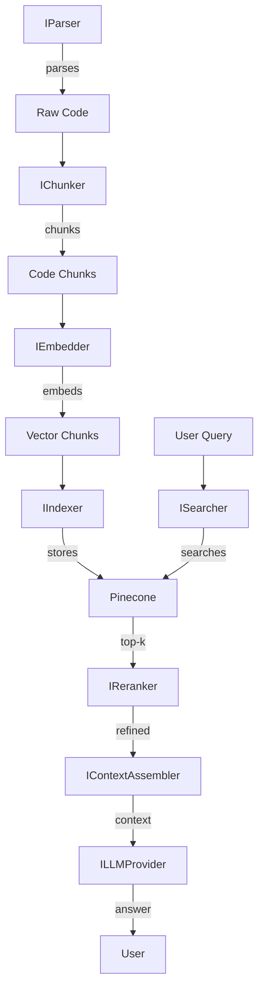

# Core Interfaces Architecture

This document describes the abstract interfaces used across ingestion, retrieval, and generation. See [PRD Epic 0](../PRD.md#epic-0-project-foundation--configuration) and [Design Document](../research/DESIGN-DOCUMENT.md).

## Purpose by interface

| Interface | Purpose |
|-----------|---------|
| **IParser** | Parse source files into logical boundaries (e.g. COBOL paragraphs/sections). |
| **IChunker** | Split parsed content into chunks with optional overlap. |
| **IEmbedder** | Generate embedding vectors for text batches (e.g. Voyage-code-3). |
| **IIndexer** | Upsert/delete vectors and metadata in the vector store (e.g. Pinecone). |
| **ISearcher** | Run hybrid/vector search for a query (top-k, optional filters). |
| **IReranker** | Rerank search results (e.g. Zerank-2). |
| **IContextAssembler** | Build a single context string from results for the LLM. |
| **ILLMProvider** | Generate an answer from prompt, context, and query (e.g. Claude). |

## Data models

- **Chunk**: `content`, `metadata`, optional `embedding`.
- **Query**: `text`, `filters`, `top_k`.
- **SearchResult**: `chunks`, `scores`, `citations`.

## Architecture diagram

## Usage example

Implementations live in later epics (e.g. Epic 1: `COBOLParser` implements `IParser`). Depend on these abstractions so that concrete implementations can be swapped or tested in isolation (DIP).
