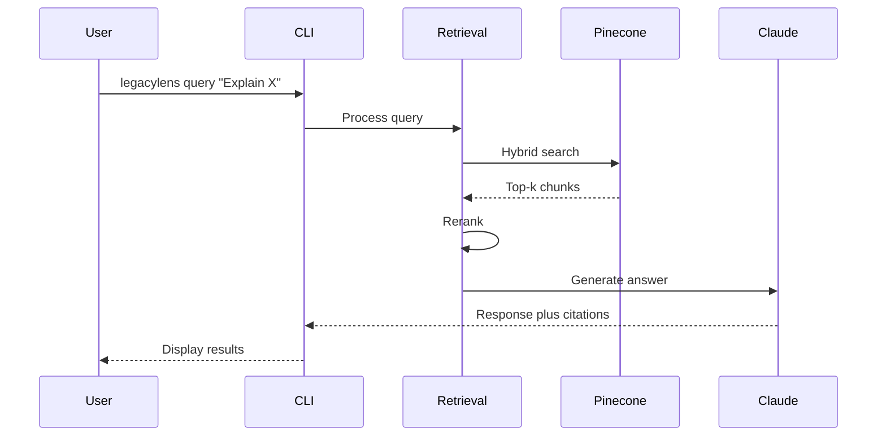

# RAG and Legacy Code Primer

This primer explains the concepts behind LegacyLens: what [RAG](#what-is-rag) is, how the system works end-to-end, why legacy code needs special handling, and how the chosen [tech stack](TECH-STACK-GUIDE.md) maps to those needs. It is aimed at new developers, reviewers, and stakeholders who are new to RAG or legacy codebases.

For architecture and decisions, see [DESIGN-DOCUMENT.md](../research/DESIGN-DOCUMENT.md) and [RECORD-ARCHITECTURE-DECISIONS.md](../research/RECORD-ARCHITECTURE-DECISIONS.md). For tradeoffs (e.g. why code-optimized embeddings, hybrid search), see [IDENTIFY-TRADEOFFS.md](../research/IDENTIFY-TRADEOFFS.md). For definitions of terms, see the [Glossary](../GLOSSARY.md).

---

## What is RAG?

**Retrieval-Augmented Generation (RAG)** is a pattern where you:

1. **Retrieve** relevant pieces of information (e.g. code snippets) from a store using the user’s question.
2. **Augment** the LLM’s context with those pieces.
3. **Generate** an answer that is grounded in the retrieved content, with citations.

Instead of relying only on the model’s training data, RAG gives the model access to your **current** codebase. That makes it possible to “query the codebase in natural language” and get accurate, traceable answers (file/line references). LegacyLens is a RAG system built for legacy enterprise code (COBOL, Fortran): it indexes the code, retrieves relevant chunks for each question, and uses an LLM to produce explanations with citations.

---

## End-to-end flow

LegacyLens has two main flows: **ingestion** (one-time or incremental) and **query** (every user question).

### Ingestion

1. **Parse** — Read source files and identify logical units (e.g. COBOL paragraphs, Fortran subroutines) using [syntax-aware](../GLOSSARY.md#syntax-aware-chunking) boundaries.
2. **Chunk** — Split the code into [chunks](../GLOSSARY.md#chunk) with metadata (file path, line numbers, scope). Use hierarchical structure (file → section → function) and 10–25% overlap.
3. **Embed** — Turn each chunk into a vector using a code-optimized [embedding](../GLOSSARY.md#embedding) model (Voyage-code-3).
4. **Store** — Save vectors and metadata in a [vector database](../GLOSSARY.md#vector-database) (Pinecone). Optionally cache embeddings in Redis (content-hash) to skip re-embedding unchanged chunks.

Ingestion runs as a batch for the initial index and can be repeated or triggered incrementally (e.g. on code changes via CI).

### Query

1. **Embed** — Encode the user’s natural-language question with the same embedding model.
2. **Search** — Run [hybrid search](../GLOSSARY.md#hybrid-search) (vector + keyword/BM25) to get top-k candidates (e.g. 20–50).
3. **Rerank** — Use a second-pass [reranker](../GLOSSARY.md#reranker) to keep the top-5–10 most relevant chunks.
4. **Assemble** — Build a context string from the reranked chunks and their metadata (file/line/scope).
5. **Generate** — Send the context and a citation-focused prompt to the LLM (Claude); stream the answer with file/line [citations](../GLOSSARY.md#citation).

Optional: for ambiguous queries, use multi-query expansion (agentic) to improve results.

---

## Concepts

- **Chunking** — Splitting the codebase into units that are embedded and retrieved. [Syntax-aware chunking](../GLOSSARY.md#syntax-aware-chunking) uses language boundaries (paragraphs, subroutines); [fixed-size](../GLOSSARY.md#chunking) splitting ignores structure and can cut logical units in half. LegacyLens uses syntax-aware (e.g. LlamaParse v2) with hierarchical structure and overlap.
- **Embeddings** — Dense vector representations of text (or code). Similar meaning or structure maps to similar vectors so that similarity search finds relevant chunks.
- **Vector search** — Finding chunks whose embedding vectors are closest to the query embedding (e.g. cosine similarity). Good for semantic “what does this do?” style questions.
- **Hybrid search** — Combining vector similarity with keyword search (e.g. BM25). Essential for exact identifiers (e.g. `CUSTOMER-RECORD`, subroutine names) that vector search may miss.
- **Reranking** — A second model scores the top-k search results and keeps the best few. Improves [precision](../GLOSSARY.md#precision) (e.g. >70% top-5) with limited extra latency.
- **Context assembly** — Concatenating the reranked chunks (and metadata) into a single context string that fits the LLM’s window and is passed in the prompt.
- **Citation-focused generation** — Prompting the LLM to quote or reference only the provided context and to output explicit file/line references so answers are traceable and hallucinations are reduced.

---

## Why legacy code is different

Legacy enterprise code (COBOL, Fortran) has characteristics that affect how we build RAG:

1. **Exact identifiers** — Names like `CUSTOMER-RECORD` or `CALCULATE-INTEREST` must be found precisely. Pure vector search can miss them; [hybrid search](../GLOSSARY.md#hybrid-search) (vector + keyword) is used so exact matches are not lost.
2. **Logical boundaries** — Code is organized in paragraphs (COBOL), subroutines (Fortran), or sections. Chunks should follow these boundaries so that “Explain paragraph X” retrieves a full paragraph, not a random slice. That’s why we use [AST](../GLOSSARY.md#ast)-based, [syntax-aware chunking](../GLOSSARY.md#syntax-aware-chunking).
3. **File/line traceability** — Users and audits need “where in the repo?” answers. Metadata (file path, line start/end, scope) is stored with each chunk and included in the prompt and in the LLM’s citations.
4. **Dependencies** — “What calls this?” or “What does this call?” require a notion of call graph or dependencies. LegacyLens supports this later via [GraphRAG](../GLOSSARY.md#graphrag) and Neo4j.

So: the chosen stack emphasizes **code-optimized embeddings**, **hybrid search**, **syntax-aware chunking**, and **citation-focused prompts** to fit legacy code. See [IDENTIFY-TRADEOFFS.md](../research/IDENTIFY-TRADEOFFS.md) for the tradeoffs behind these choices.

---

## How the chosen stack maps to these needs

| Need | How the stack addresses it |
|------|-----------------------------|
| **Code recall** | Voyage-code-3 embeddings (~14–20% better on code than general models). |
| **Exact terms** | Pinecone hybrid search (vector + BM25) for identifiers like `CUSTOMER-RECORD`. |
| **Precision** | Zerank-2 reranker: top-k from hybrid → top-5–10 for context. |
| **Explanations and citations** | Claude 4.5 Sonnet with strict citation prompts and file/line in context. |
| **Logical boundaries** | LlamaParse v2 (and/or custom parsers) for COBOL paragraphs / Fortran subroutines. |
| **Dependencies (future)** | Neo4j and GraphRAG for “what calls X?” and impact analysis. |
| **Low latency** | Serverless Pinecone (<100 ms p99), caching (Redis), target <3s [E2E latency](../GLOSSARY.md#e2e-latency). |
| **Cost control** | Free tiers (Pinecone, Voyage 200M tokens), Redis cache to skip re-embedding, prompt caching for repeated context. |

For setup and usage of each component, see [TECH-STACK-GUIDE.md](TECH-STACK-GUIDE.md). For a short list of terms, see the [Glossary](../GLOSSARY.md).
